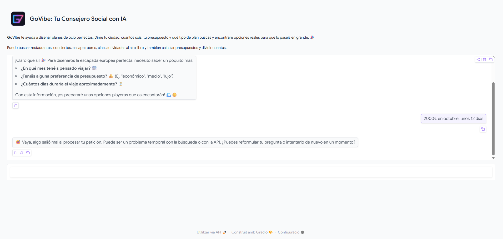
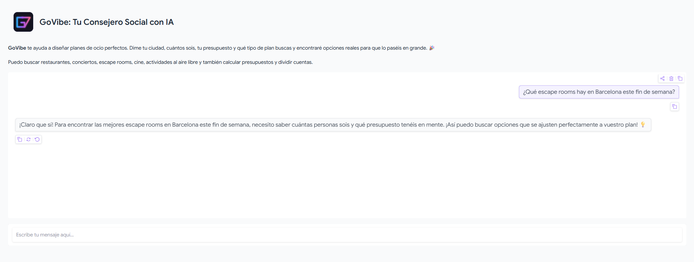
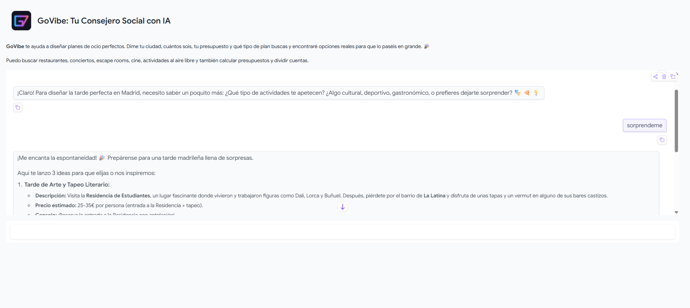

# 🚀 GoVibe: Tu Conserje Social con IA

GoVibe es un agente conversacional inteligente que actúa como tu conserje de ocio personal. Dile quién eres, con quién vas, qué presupuesto tienes y qué energía buscas, y él diseñará un plan a medida con opciones reales, precios aproximados e itinerarios completos.

---

## Características principales

- **Búsqueda en tiempo real** de restaurantes, conciertos, escape rooms, cines y más vía DuckDuckGo.
- **Cálculo de presupuestos** y división de cuentas entre amigos.
- **Memoria conversacional**: recuerda el contexto del chat para no repetir preguntas.
- **Interfaz web amigable** construida con Gradio, lista para desplegarse en Hugging Face Spaces.

---

## Arquitectura

```
Usuario (Gradio UI)
       │
       ▼
  chat()  ←──── historial completo de mensajes (memoria conversacional)
       │
       ▼
 create_agent  (LangChain · ReAct agent con LangGraph)
       │
  ┌────┴────┐
  ▼         ▼
DuckDuckGo  calcular_presupuesto
Search      (@tool personalizado)
       │
       ▼
ChatGoogleGenerativeAI
  (gemini-2.5-flash-lite, temp=0.7)
```

| Capa | Tecnología | Rol |
|---|---|---|
| LLM | gemini-2.5-flash-lite (Google AI) | Razonamiento y generación de texto |
| Orquestación | `langchain.agents.create_agent` | Decide qué herramienta usar y cuándo |
| Herramienta 1 | `DuckDuckGoSearchRun` | Busca planes y actividades reales |
| Herramienta 2 | `@tool calcular_presupuesto` | Aritmética de presupuestos |
| Memoria | Historial de mensajes en estado Gradio | Mantiene el contexto de la conversación |
| UI | Gradio `Blocks` + `Chatbot` | Interfaz web de chat |

---

## Instalación y ejecución local

### Requisitos previos

- Python 3.10 o superior
- Una clave de API de Google AI Studio (gratuita): [https://aistudio.google.com/app/apikey](https://aistudio.google.com/app/apikey)

### Pasos

```bash
# 1. Clona el repositorio
git clone https://github.com/gmampelf/GoVibe.git
cd GoVibe

# 2. Crea y activa un entorno virtual
python -m venv .venv
# En macOS/Linux:
source .venv/bin/activate
# En Windows:
.venv\Scripts\activate

# 3. Instala las dependencias
pip install -r requirements.txt

# 4. Configura las variables de entorno
cp .env.example .env
# Abre .env y reemplaza "tu_clave_aqui" con tu clave de Google AI

# 5. Lanza la aplicación
python app.py
```

La aplicación estará disponible en [http://localhost:7860](http://localhost:7860).

---

## Capturas de pantalla







---

## Ejemplos de uso

| Pregunta | Herramienta activada |
|---|---|
| "Planea una tarde en Madrid para 2 por 50€" | DuckDuckGo Search |
| "¿Qué escape rooms hay en Barcelona este finde?" | DuckDuckGo Search |
| "Gastamos 180€ entre 4, ¿cuánto toca por persona?" | calcular_presupuesto |
| "Hazme un itinerario completo para mañana" | DuckDuckGo Search + respuesta directa |

---

## Despliegue en Hugging Face Spaces

1. Crea un nuevo Space en [huggingface.co/spaces](https://huggingface.co/spaces) con SDK **Gradio**.
2. Sube todos los archivos del proyecto (excepto `.env`).
3. En la pestaña **Settings → Repository secrets** del Space, añade:
   - **Name:** `GOOGLE_API_KEY`
   - **Value:** tu clave real de Google AI
4. El Space leerá automáticamente esa variable de entorno al arrancar.

> **Importante:** nunca subas el archivo `.env` ni tu clave real a ningún repositorio público. Usa siempre los secretos del proveedor de despliegue.

---

## Estructura del proyecto

```
govibe/
├── app.py            # Núcleo de la aplicación (agente + UI)
├── requirements.txt  # Dependencias de Python
├── .env.example      # Plantilla de variables de entorno
├── .env              # Tu clave real (NO subir a git)
└── README.md         # Este archivo
```

---

## Licencia

MIT © 2025 GoVibe
